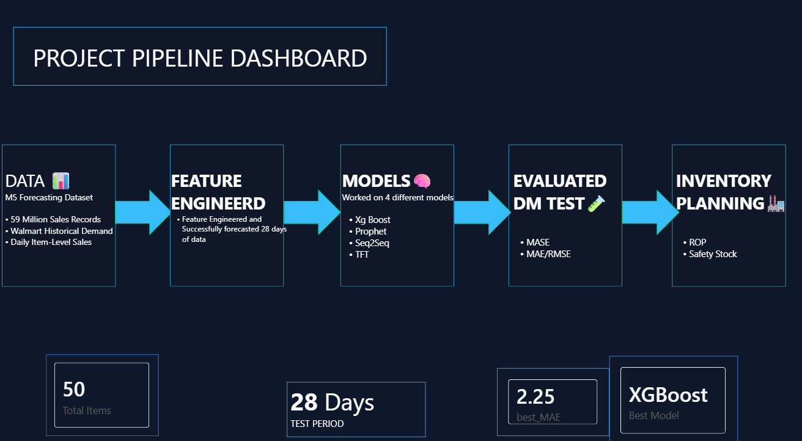
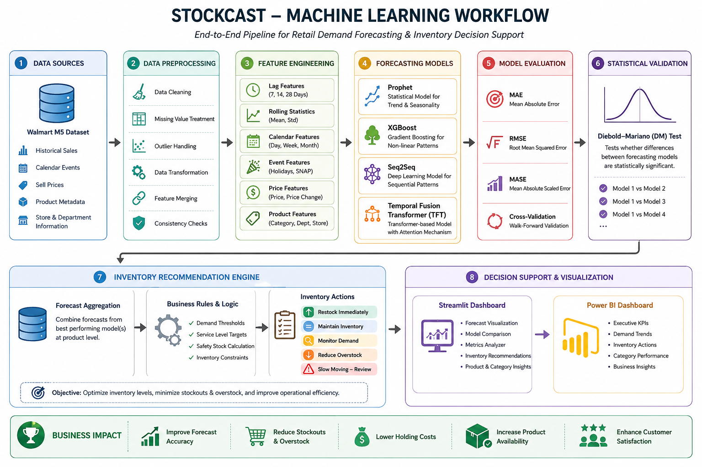
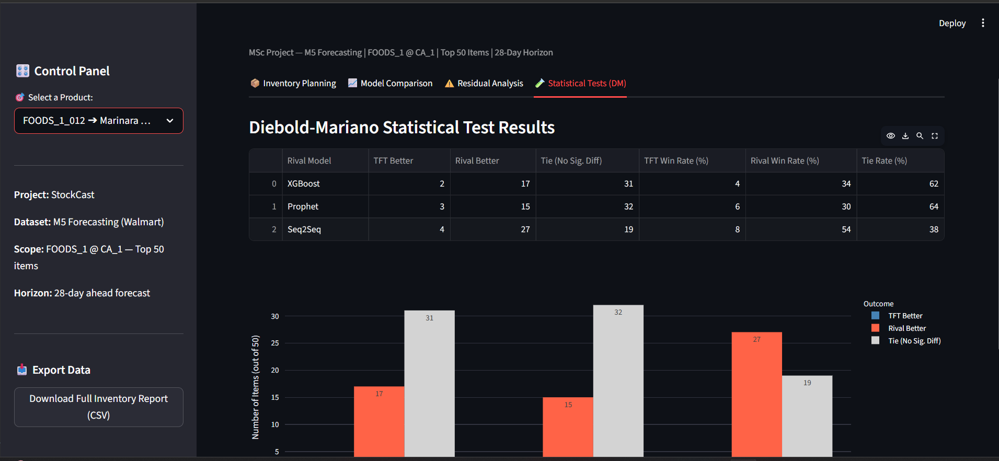

<!-- ========================================================= -->
<!--                        STOCKCAST                          -->
<!-- ========================================================= -->

<h1 align="center">
📈 StockCast
</h1>

<h3 align="center">
An End-to-End Machine Learning Platform for Retail Demand Forecasting & Inventory Intelligence
</h3>

<p align="center">


</p>

---

## 📌 Key Achievements

- Forecasted demand for 50 retail products using four forecasting methodologies
- Compared statistical, machine learning, deep learning, and transformer-based models
- Performed Diebold–Mariano statistical testing for objective model comparison
- Built an interactive Streamlit application for forecasting and inventory planning
- Developed an executive Power BI dashboard for business insights

---

## 🚀 Dashboard Preview

<p align="center">


<br><br>


</p>

---

# 📌 At a Glance

| Metric | Value |
|---------|-------|
| 🎯 Objective | Retail Demand Forecasting |
| 📦 Dataset | Walmart M5 Forecasting |
| 🤖 Forecasting Models | Prophet, XGBoost, Seq2Seq & TFT |
| 📈 Evaluation Metrics | MAE, RMSE & MASE |
| 📉 Statistical Validation | Diebold–Mariano Test |
| 📊 Dashboards | Streamlit & Power BI |
| 💻 Language | Python |
| 🔬 Frameworks | PyTorch, Prophet, XGBoost |
| 📅 Forecast Horizon | 28 Days |
| 🏪 Business Goal | Inventory Planning & Decision Support |

---

# ⭐ Project Highlights

- ✅ End-to-End Machine Learning Pipeline
- ✅ Retail Demand Forecasting
- ✅ Advanced Feature Engineering
- ✅ Multiple Forecasting Models
- ✅ Statistical Model Validation
- ✅ Inventory Recommendation Engine
- ✅ Interactive Streamlit Dashboard
- ✅ Executive Power BI Dashboard
- ✅ Business Decision Support
- ✅ Modular Project Structure

---

# 💼 Why StockCast?

Inventory planning is one of the most challenging problems in retail analytics. Overstocking increases operational costs, while stock shortages reduce customer satisfaction and revenue.

StockCast was developed to address this challenge by combining **statistical forecasting**, **machine learning**, **deep learning**, and **business intelligence** into a unified forecasting platform.

Unlike traditional forecasting projects that end with model predictions, StockCast continues the workflow by statistically validating competing models, generating inventory recommendations, and presenting actionable insights through interactive dashboards.

The project demonstrates the complete lifecycle of a real-world machine learning solution—from raw retail sales data to business-ready decision support.

---

<!-- ========================================================= -->
<!--                    SYSTEM ARCHITECTURE                    -->
<!-- ========================================================= -->

# 🏗️ System Architecture

StockCast follows a modular architecture that separates data processing, forecasting, statistical evaluation, and business intelligence into independent components. This modular design makes the pipeline easier to maintain, extend, and adapt for future production deployment.

<p align="center">

</p>

### Architecture Overview

The workflow consists of five major layers:

| Layer | Purpose |
|--------|---------|
| 📂 Data Layer | Load and integrate retail sales, calendar, and pricing datasets |
| ⚙️ Processing Layer | Clean, transform, and engineer predictive features |
| 🤖 Forecasting Layer | Train multiple forecasting models independently |
| 📊 Evaluation Layer | Compare model performance using metrics and statistical tests |
| 💼 Business Layer | Generate inventory recommendations and interactive dashboards |

This layered architecture ensures that each stage of the pipeline can evolve independently without affecting downstream components.

---

# 🔄 Machine Learning Pipeline

The forecasting workflow transforms raw retail transaction data into actionable inventory recommendations through a structured machine learning pipeline.

<p align="center">

</p>

---

## Pipeline Stages

### ① Data Acquisition

The forecasting pipeline begins with the Walmart M5 Forecasting dataset, combining multiple data sources into a unified analytical dataset.

**Input Sources**

- Historical sales records
- Calendar information
- Product metadata
- Weekly selling prices

---

### ② Data Preparation

Raw retail datasets undergo preprocessing before model training.

Key preprocessing tasks include:

- Missing value treatment
- Duplicate removal
- Calendar integration
- Dataset merging
- Data validation
- Feature normalization

The objective is to create a consistent and model-ready dataset.

---

### ③ Predictive Feature Engineering

Instead of relying only on historical sales, StockCast engineers predictive features that capture temporal patterns, pricing behaviour, and business events.

| Feature Category | Examples |
|------------------|----------|
| 📅 Calendar Features | Day, Week, Month, Year |
| 📈 Lag Features | 7, 14 & 28-Day Lags |
| 📊 Rolling Statistics | Rolling Mean & Standard Deviation |
| 💲 Price Features | Selling Price & Price Changes |
| 🎉 Event Features | SNAP Events & Holidays |
| 🏬 Product Features | Category, Department & Store |

These features enable forecasting models to learn seasonality, trends, promotions, and purchasing behaviour more effectively.

---

### ④ Forecast Generation

Four independent forecasting models are trained and evaluated using identical forecasting horizons.

The implementation combines:

- Statistical Forecasting
- Machine Learning
- Deep Learning
- Transformer-based Forecasting

This allows direct comparison between fundamentally different forecasting approaches.

---

### ⑤ Model Evaluation

Each model is evaluated using multiple complementary performance metrics.

The project uses:

- Mean Absolute Error (MAE)
- Root Mean Squared Error (RMSE)
- Mean Absolute Scaled Error (MASE)

Using multiple metrics provides a more comprehensive assessment than relying on a single error measure.

---

### ⑥ Statistical Validation

Performance differences between competing models are verified using the **Diebold–Mariano Test**.

Rather than assuming that lower error always indicates a better model, the DM Test evaluates whether observed improvements are statistically significant.

This provides greater confidence when selecting the final forecasting model.

---

### ⑦ Inventory Intelligence

The final stage transforms demand forecasts into business recommendations.

Forecast outputs are translated into inventory actions such as:

- 📦 Restock
- 📉 Reduce Inventory
- 📊 Maintain Stock Levels
- ⚠️ Monitor Demand
- 🛒 Identify Slow-Moving Products

This bridges the gap between machine learning predictions and real-world inventory planning.

---

<!-- ========================================================= -->
<!--               FORECASTING MODELS & EVALUATION             -->
<!-- ========================================================= -->

# 🤖 Forecasting Models

Retail demand exhibits diverse patterns across products, making it difficult for a single forecasting algorithm to consistently perform best. To address this challenge, StockCast evaluates four complementary forecasting approaches spanning statistical forecasting, machine learning, deep learning, and transformer-based architectures.

Each model was trained under the same forecasting framework and evaluated using identical prediction horizons, allowing for a fair comparison of forecasting performance.

| Model | Category | Primary Capability |
|--------|----------|--------------------|
| 📈 Prophet | Statistical Forecasting | Trend & Seasonality Modelling |
| 🌳 XGBoost | Machine Learning | Feature-Based Nonlinear Forecasting |
| 🧠 Seq2Seq | Deep Learning | Sequential Pattern Learning |
| ⚡ Temporal Fusion Transformer (TFT) | Transformer Architecture | Multi-Horizon Forecasting with Attention |

---

## Why Multiple Models?

Each forecasting model captures different characteristics of retail demand.

| Model | Strength |
|--------|----------|
| 📈 Prophet | Captures trend, seasonality, and holiday effects through an additive statistical framework. |
| 🌳 XGBoost | Learns complex nonlinear relationships using engineered temporal, price, and calendar features. |
| 🧠 Seq2Seq | Models sequential dependencies through an encoder-decoder neural network architecture. |
| ⚡ TFT | Utilizes attention mechanisms and variable selection for interpretable multi-horizon forecasting. |

Rather than assuming a single model would outperform others, StockCast evaluates all four approaches to determine the most suitable forecasting methodology for retail demand prediction.

---

# 📊 Forecast Evaluation

Model performance was evaluated using three complementary forecasting metrics.

| Metric | Purpose |
|---------|---------|
| **MAE** | Measures average forecasting error |
| **RMSE** | Penalizes larger forecasting errors |
| **MASE** | Provides scale-independent comparison across products |

Using multiple evaluation metrics provides a more comprehensive assessment of forecasting performance than relying on a single error measure.

<p align="center">

</p>

---

# 🏆 Forecasting Performance

| Model | MAE | RMSE | MASE |
|--------|----:|-----:|------:|
| 📈 Prophet | **2.701** | **4.007** | **1.164** |
| 🌳 XGBoost | **1.003** | **2.002** | **0.809** |
| 🧠 Seq2Seq | **2.480** | **3.570** | **0.912** |
| ⚡ TFT | **2.836** | **4.090** | **1.146** |

### Key Observations

- XGBoost achieved the lowest forecasting error across all three evaluation metrics.
- Seq2Seq demonstrated competitive deep learning performance with improved accuracy over Prophet.
- Prophet provided strong interpretability while effectively modelling trend and seasonality.
- TFT served as the transformer-based forecasting model for comparative evaluation.

The diversity of forecasting approaches enables StockCast to compare statistical, machine learning, and deep learning methodologies within a unified experimental framework.

---

# 📉 Statistical Validation using the Diebold–Mariano Test

Forecasting metrics alone do not indicate whether differences in model performance are statistically significant. Therefore, StockCast incorporates the **Diebold–Mariano (DM) Test** to validate forecasting accuracy.

Unlike pairwise comparisons between every model, the DM Test implementation within StockCast uses the **Temporal Fusion Transformer (TFT)** as the reference forecasting model and evaluates its predictive performance against each competing approach.

### Statistical Comparisons

- ⚡ TFT vs 📈 Prophet
- ⚡ TFT vs 🌳 XGBoost
- ⚡ TFT vs 🧠 Seq2Seq

<p align="center">

</p>

### DM Test Summary

| Comparison | TFT Better | Rival Better | Tie |
|------------|-----------:|-------------:|----:|
| TFT vs Prophet | **3** | **15** | **32** |
| TFT vs XGBoost | **2** | **17** | **31** |
| TFT vs Seq2Seq | **4** | **27** | **19** |

The DM Test complements traditional forecasting metrics by determining whether observed performance differences are statistically significant rather than the result of random variation.

Across the evaluated products, XGBoost and Seq2Seq more frequently outperformed TFT, while many comparisons resulted in statistically insignificant differences, demonstrating that forecasting performance varies across different retail products and demand patterns.

---

# 📦 Inventory Intelligence

Accurate forecasts are valuable only when they support operational decision-making. To bridge the gap between prediction and business action, StockCast transforms forecasting outputs into inventory recommendations.

Based on forecasted demand, products are categorized into actionable inventory decisions that assist planners in replenishment and stock optimization.

| Recommendation | Description |
|---------------|-------------|
| 📦 Restock | Expected increase in demand |
| 📊 Maintain Stock | Inventory level is appropriate |
| 📉 Reduce Inventory | Expected decline in demand |
| ⚠️ Monitor | Demand uncertainty requires attention |
| 🛒 Slow Moving | Low-demand products requiring review |

By integrating forecasting with inventory intelligence, StockCast extends beyond predictive modelling to support practical retail decision-making.

---

---

<details>

<summary><b>📂 Repository Organization</b></summary>

```text
StockCast/
│
├── 📁 data/
│
├── 📁 images/
|   
├── 📁 notebooks/
│   ├── 01_data_preprocessing.ipynb
│   ├── 02_feature_engineering.ipynb
│   ├── 03_prophet.ipynb
│   ├── 04_xgboost.ipynb
│   ├── 05_seq2seq.ipynb
│   ├── 06_tft.ipynb
│   ├── 07_model_comparison.ipynb
│   └── 08_inventory_recommendation.ipynb
│
├── 📁 outputs/
│   ├── Forecast Results
│   ├── Model Metrics
│   ├── DM Test Results
│   └── Inventory Reports
│
├── 📁 powerbi/
│

├── 📁 streamlit_app/
|   ├── app.py
|   ├── Dashboard Files    
|  
|
│
├── requirements.txt
├── LICENSE
└── README.md

```

</details>

---

---

<details>

<summary><b>⚙️ Installation Guide</b></summary>

### Clone the Repository

```bash
git clone https://github.com/nevil002/StockCast.git
```

### Create Virtual Environment

```bash
python -m venv venv
```

### Activate Environment

Windows

```bash
venv\Scripts\activate
```

Linux / macOS

```bash
source venv/bin/activate
```

### Install Dependencies

```bash
pip install -r requirements.txt
```

### Launch Streamlit

```bash
streamlit run app.py
```

</details>

---

---
<details>

<summary><b>📦 Core Technologies</b></summary>

| Category | Technologies |
|-----------|--------------|
| Programming | Python |
| Data Processing | Pandas, NumPy |
| Machine Learning | XGBoost |
| Deep Learning | PyTorch |
| Statistical Forecasting | Prophet |
| Visualization | Plotly, Matplotlib |
| Dashboard | Streamlit |
| Business Intelligence | Power BI |

</details>

---

---
<details>

<summary><b>🚀 Future Enhancements</b></summary>

### Planned Improvements

- [ ] Docker Deployment
- [ ] FastAPI Prediction Service
- [ ] MLflow Experiment Tracking
- [ ] CI/CD Pipeline
- [ ] Azure Cloud Deployment
- [ ] SHAP Explainability
- [ ] Automated Model Retraining
- [ ] Real-Time Forecast Monitoring

</details>

---


---

# 👨‍💻 About the Developer

**Nevil Mathew Shelly**

M.Sc. Data Analytics

Interested in:

- Machine Learning
- Time Series Forecasting
- Data Engineering
- Business Intelligence
- AI Applications

### Connect


### Connect

- 💼 **LinkedIn:** https://www.linkedin.com/in/nevil-mathew-shelly/
- 💻 **GitHub:** https://github.com/nevil002
- 📧 **Email:** mailto:nevilmathewshelly02@gmail.com

---

<div align="center">

### ⭐ If you found this project useful, consider giving it a Star.

Thank you for visiting the repository.

Built with ❤️ using

**Python • PyTorch • XGBoost • Streamlit • Power BI**

</div>
---

